# 🏗️ Architecture Documentation

## System Architecture Overview

This document provides a comprehensive overview of the Caption Cursor Studio architecture, including component relationships, data flow, and design patterns.

---

## 📊 High-Level Architecture

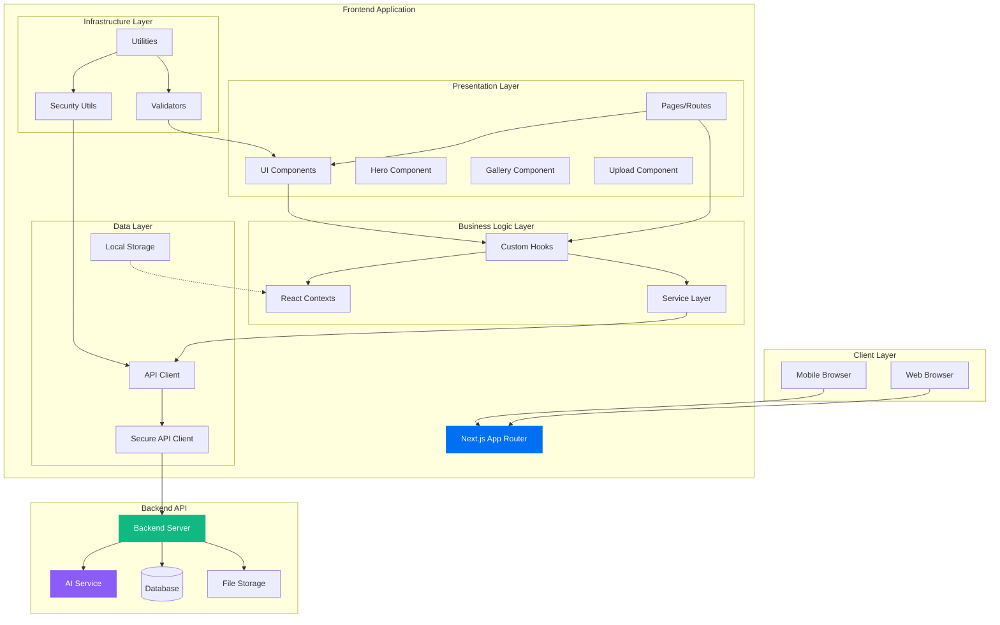

---

## 🎯 Component Architecture

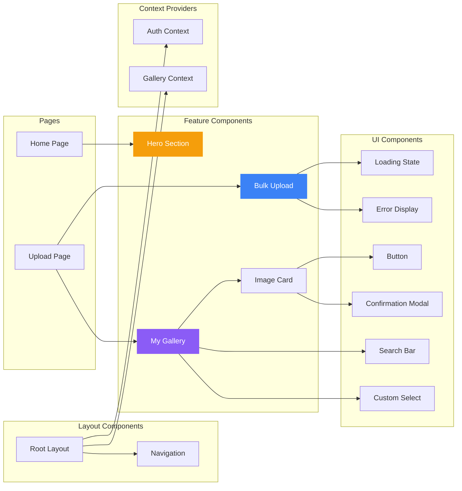

---

## 🔄 Data Flow Architecture

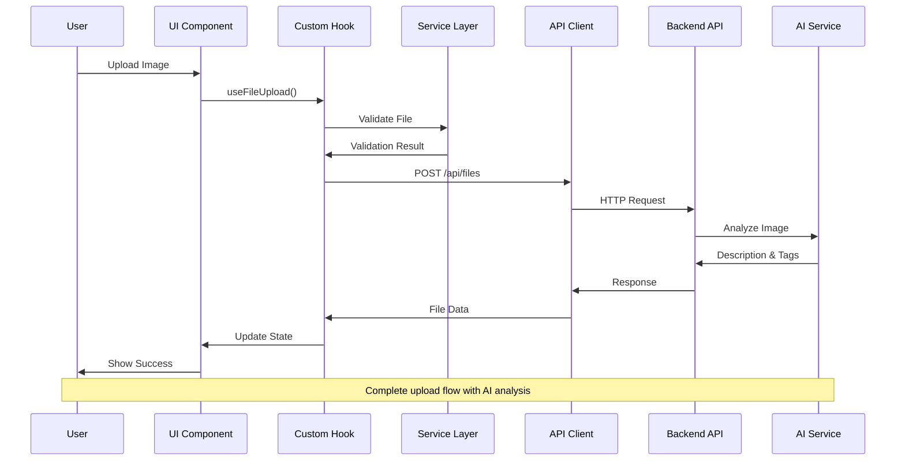

---

## 🏛️ Layered Architecture

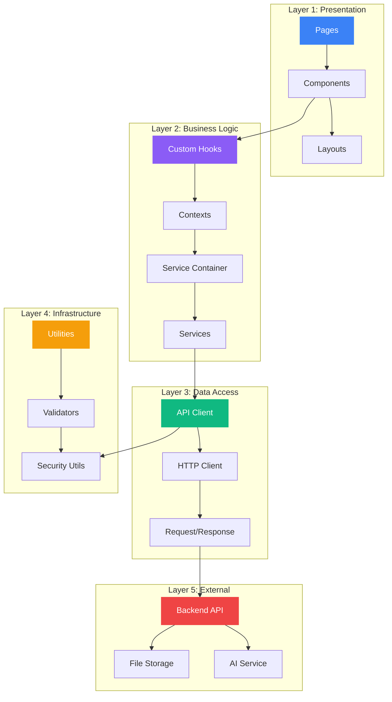

---

## 🔐 Security Architecture

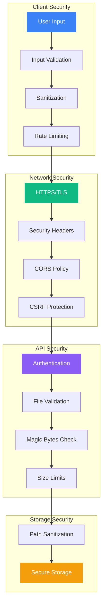

---

## 📦 Service Container Pattern

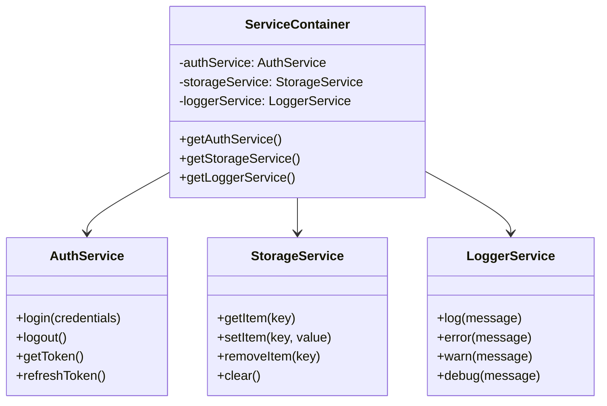

---

## 🎨 State Management

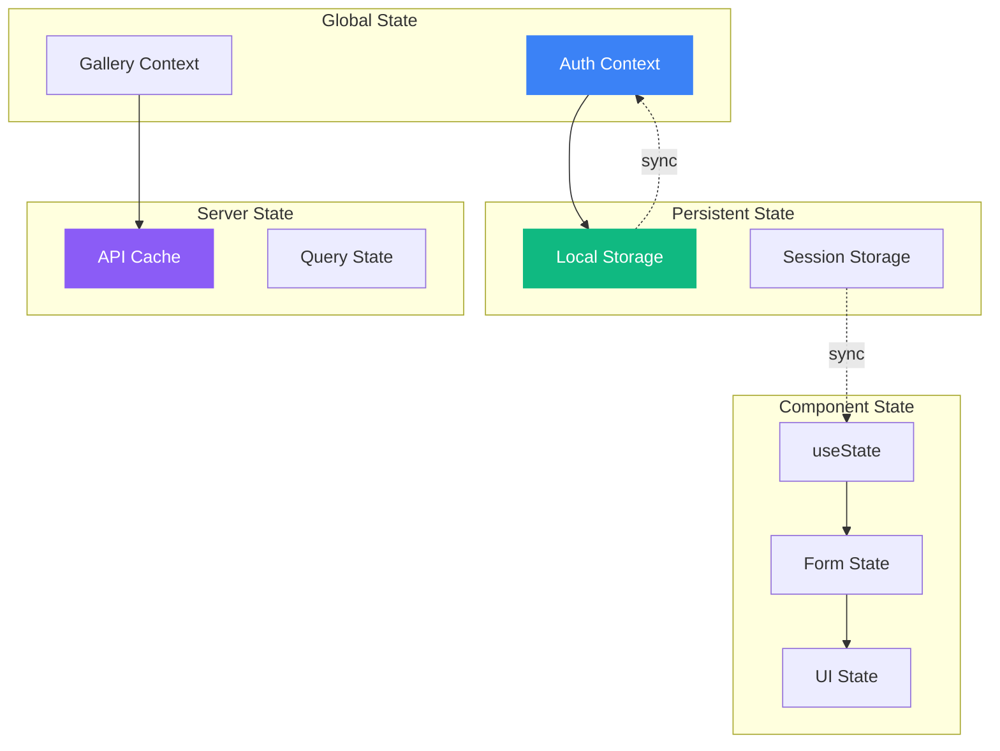

---

## 🚀 Deployment Architecture

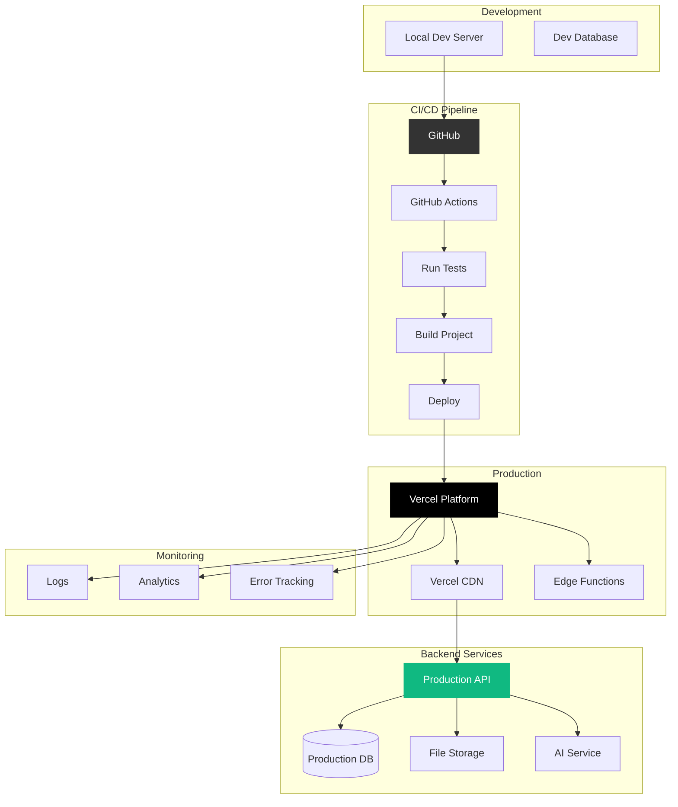

---

## 📱 Responsive Design Architecture

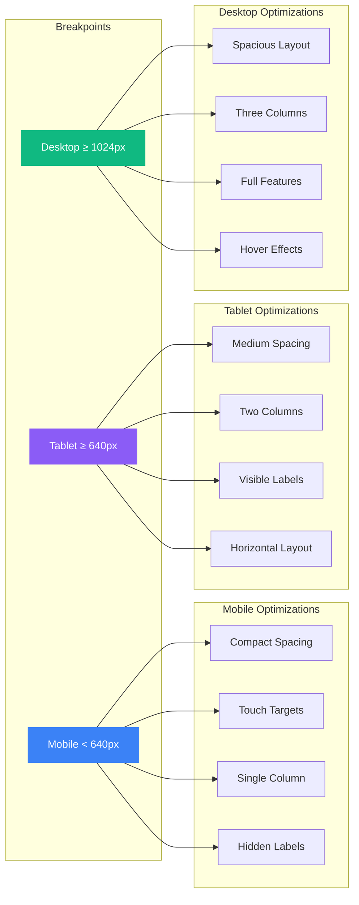

---

## 🧪 Testing Architecture

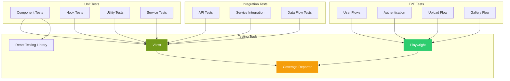

---

## 🔄 API Request Flow

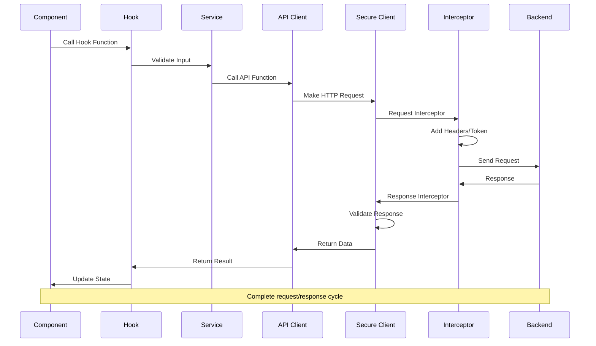

---

## 📂 File Structure Mapping

```
src/
├── app/                          # Next.js App Router (Presentation Layer)
│   ├── layout.tsx               # Root layout with providers
│   ├── page.tsx                 # Home page
│   └── upload/                  # Upload feature
│       └── page.tsx             # Upload page
│
├── components/ui/               # UI Components (Presentation Layer)
│   ├── Button.tsx              # Reusable button
│   ├── BulkUpload.tsx          # Upload component
│   ├── MyGallery.tsx           # Gallery component
│   ├── MyImageCard.tsx         # Card component
│   ├── SearchBar.tsx           # Search component
│   ├── CustomSelect.tsx        # Select component
│   └── ...                     # Other UI components
│
├── hooks/                       # Custom Hooks (Business Logic Layer)
│   ├── useFileUpload.ts        # File upload logic
│   └── index.ts                # Hook exports
│
├── lib/                         # Libraries (Data Layer)
│   ├── api.ts                  # API functions
│   ├── contexts.tsx            # React contexts
│   ├── secureApiClient.ts      # HTTP client
│   └── utils/                  # Utility functions
│       ├── validators.ts       # Validation utilities
│       ├── security.ts         # Security utilities
│       └── ...                 # Other utilities
│
├── core/                        # Core Services (Business Logic Layer)
│   └── services/
│       ├── container.ts        # DI container
│       └── implementations/    # Service implementations
│           ├── AuthService.ts
│           ├── StorageService.ts
│           └── LoggerService.ts
│
└── middleware.ts                # Next.js middleware (Infrastructure Layer)
```

---

## 🎯 Design Patterns Used

### 1. **Dependency Injection (DI)**

- Service Container manages service instances
- Loose coupling between components
- Easy to mock for testing

### 2. **Repository Pattern**

- Centralized data access through API client
- Abstraction over data sources
- Consistent error handling

### 3. **Observer Pattern**

- React Context for state updates
- Components subscribe to context changes
- Decoupled component communication

### 4. **Factory Pattern**

- Service creation through container
- Singleton service instances
- Lazy initialization

### 5. **Strategy Pattern**

- Different validation strategies
- Pluggable security implementations
- Flexible file upload strategies

### 6. **Facade Pattern**

- API client simplifies backend calls
- Hooks abstract complex logic
- Clean component interfaces

---

## 🔑 Key Architectural Decisions

### ✅ **Next.js App Router**

- Modern React features (Server Components)
- Built-in routing and layouts
- Optimized performance

### ✅ **Layered Architecture**

- Clear separation of concerns
- Easy to maintain and test
- Scalable structure

### ✅ **Service Layer**

- Reusable business logic
- Dependency injection
- Testable services

### ✅ **Custom Hooks**

- Encapsulated component logic
- Reusable across components
- Easier testing

### ✅ **Context API**

- Global state management
- No external dependencies
- Simple and effective

### ✅ **Secure API Client**

- Centralized request handling
- Interceptors for auth
- Consistent error handling

---

## 📈 Scalability Considerations

### **Horizontal Scaling**

- Stateless components
- API-driven architecture
- Cacheable responses

### **Vertical Scaling**

- Code splitting
- Lazy loading
- Image optimization

### **Performance**

- Server-side rendering
- Static generation
- Edge caching

### **Maintainability**

- Clear structure
- Type safety (TypeScript)
- Comprehensive testing

---

## 🔮 Future Architecture Enhancements

### **Potential Improvements**

- WebSocket for real-time updates
- Service Workers for offline support
- Progressive Web App (PWA)
- GraphQL for flexible data fetching
- Micro-frontend architecture
- Distributed caching layer

---

Built with ❤️ following best practices and SOLID principles
